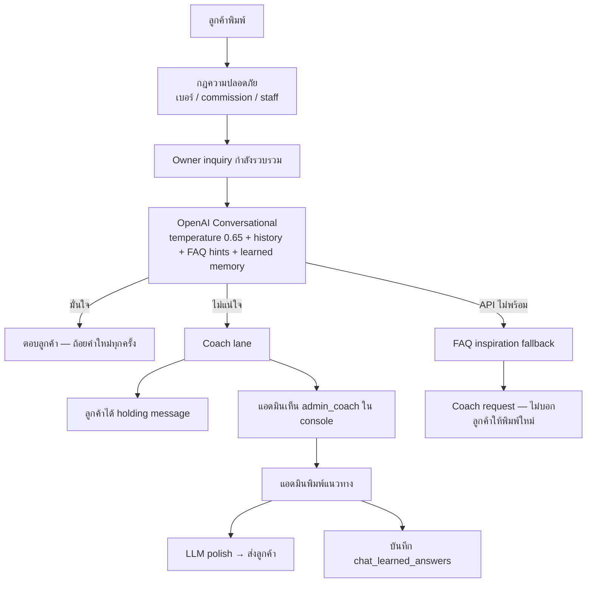

# RealXtate — Conversational Chat Architecture (Phase 18+)

**Status:** Implemented (2026-06-15)  
**เป้าหมาย:** แชทฉลาดขึ้น — FAQ เป็นไอเดีย ไม่ copy-paste · ปรึกษาแอดมินเมื่อไม่แน่ใจ · จดจำคำตอบใช้ซ้ำ

---

## Pipeline 5 ขั้น (ตาม product vision)

ทุก turn OpenAI ทำตามลำดับนี้ (บันทึกใน `analysis` JSON):

| ขั้น | ทำอะไร |
|------|--------|
| **1 อ่านลูกค้า** | จากประวัติแชท — เป็นใคร ต้องการอะไร เดาประโยคที่พิมพ์ (แก้ typo) |
| **2 เลือกกลยุทธ์** | `build_trust` / `answer_question` / `invite_viewing` / `collect_requirement` / `close_ready` / `negotiate_soft` |
| **3 จับคู่ FAQ** | เทียบกับ FAQ CATALOG (FAQ-1…N) — score 0–1 ไม่ต้องตรง keyword |
| **4 สังเคราะห์** | เอา FAQ policy + กลยุทธ์ + ข้อมูลทรัพย์ → ถ้อยคำใหม่ |
| **5 CTA** | `viewing` / `requirement_form` / `owner_inquiry` / `map` / `none` |

FAQ = **นโยบาย/ไอเดีย** · กลยุทธ์ = **ว่าจะพาไปไหน** · คำตอบ = **ผสมทั้งสองแบบเป็นธรรมชาติ**

---

## สรุปสถาปัตยกรรมใหม่



---

## ต่างจากระบบเดิมอย่างไร

| เดิม | ใหม่ |
|------|------|
| FAQ keyword → copy ทันที | FAQ = **inspiration** ใน prompt เท่านั้น |
| LLM ท้ายสุด / ไม่มีใน preview | **LLM เป็นหลัก** หลังกฎความปลอดภัย |
| 「ยังไม่แน่ใจคำถาม」 | **Coach lane** — ถามแอดมินแนวตอบ |
| Welcome ยาว + disclaimer | Welcome สั้น เป็นธรรมชาติ |
| ไม่มี memory | `chat_learned_answers` ใช้ข้ามแชท |

---

## ไฟล์หลัก

| หัวข้อ | Path |
|--------|------|
| Conversational LLM | `supabase/functions/_shared/chat_conversational_openai.ts` |
| Router LLM-first | `supabase/functions/_shared/chat_conversational_route.ts` |
| Learned memory | `supabase/functions/_shared/chat_learned_memory.ts` |
| Migration | `supabase/migrations/20260615140000_chat_conversational_coach_memory.sql` |
| Admin coach API | `supabase/functions/chat-admin-coach-reply/index.ts` |
| Welcome ใหม่ | `chat_ai_voice.ts`, `app_strings.dart` |

---

## Coach flow (แอดมิน)

1. AI ไม่มั่นใจ → ลูกค้าได้ข้อความรอสั้นๆ
2. ในแชท (เฉพาะแอดมิน) ปรากฏ `admin_coach`: 「🤖 ขอคำแนะนำ…」
3. แอดมินพิมพ์**แนวทาง** (ไม่ต้องสมบูรณ์) ในช่องที่ขึ้น hint 「แนะนำแนวตอบให้ AI」
4. `chat-admin-coach-reply` → polish → ส่ง `ai` ให้ลูกค้า + บันทึก memory

---

## Memory (`chat_learned_answers`)

- `scope`: `global` | `property_type` | `listing`
- แชทอื่นที่ไม่เกี่ยวกับทรัพย์เดียวกัน ยังใช้ `global` ได้
- LLM ได้รับเป็น **GUIDANCE** — ห้าม copy เป๊ะ

---

## Deploy

```bash
supabase db push
supabase functions deploy chat-turn chat-admin-coach-reply
```

ต้องมี `OPENAI_API_KEY` ใน Edge secrets — ไม่มีจะ fallback เป็น FAQ inspiration + coach

---

## Preview localhost

- **Preview (memory mode)** ยังไม่เรียก OpenAI — ต้องล็อกอิน Supabase + `chat-turn` จริง หรือรอ Phase ถัดไป (mirror conversational ใน Dart)
- Welcome ใหม่: `chat_ai_voice.ts`, `app_strings.dart`
- Playbook LINE OA (Pantip): [CHAT-LINE-OA-PLAYBOOK-FROM-PANTIP.md](./CHAT-LINE-OA-PLAYBOOK-FROM-PANTIP.md)

---

## Phase ถัดไป (แนะนำ)

1. Preview เรียก `chat-turn` แม้ใน trial
2. Embedding search สำหรับ learned answers
3. Admin UI จัดการ memory (ดู/แก้/ปิด)
4. วัด drop-off rate ก่อน/หลัง
5. **Playbook จาก LINE OA (Pantip)** — ดู [CHAT-LINE-OA-PLAYBOOK-FROM-PANTIP.md](./CHAT-LINE-OA-PLAYBOOK-FROM-PANTIP.md) · สต็อกใน `chat_ai_voice.ts` · ผสานใน `chat_conversational_openai.ts`
