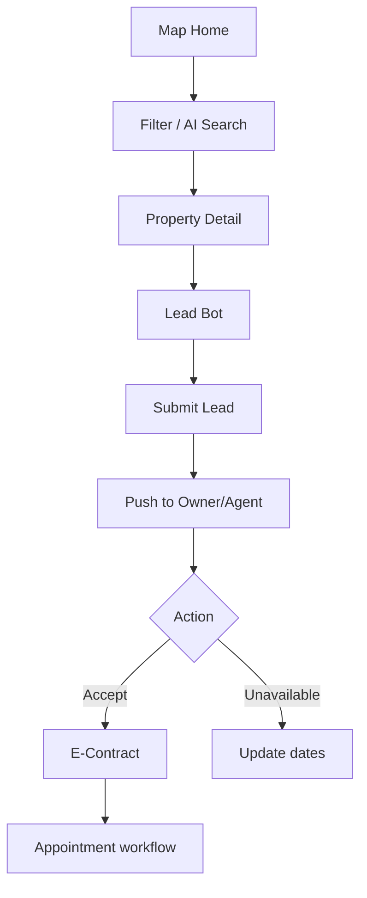
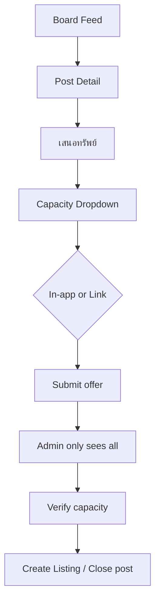
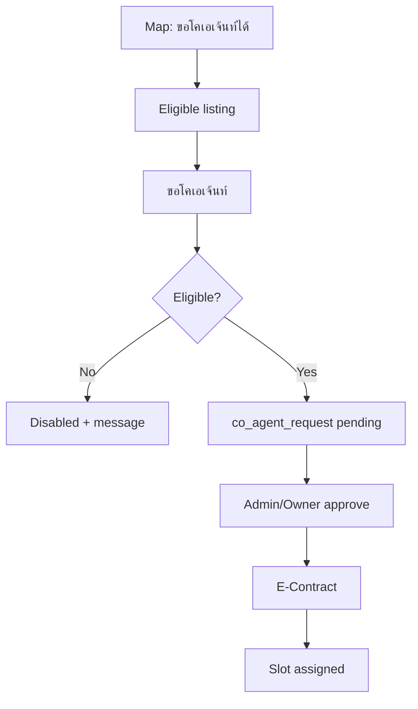

# Phase 2: Wireframes & UX Flows

**LivingBKK** — Map-first, Purple & White, Airbnb-inspired  
**Version:** 1.0 · **Date:** 2026-06-02  
**Design tokens:** [../design/tokens.json](../design/tokens.json)

---

## 1. Global Navigation

### Bottom Tab Bar (ทุก role ที่ล็อกอิน)

```
┌────────────────────────────────────────────────────────────┐
│  [🗺 ค้นหา]  [📋 บอร์ด]  [📥 งาน]  [💬 ติดต่อ]  [👤 ฉัน]   │
└────────────────────────────────────────────────────────────┘
```

| Tab | Seeker | Owner | Agent |
|-----|--------|-------|-------|
| ค้นหา | Map Home | Map Home | Map Home + co-agent segment |
| บอร์ด | Demand feed | Demand feed | Demand feed |
| งาน | My leads sent | Leads inbox + offers | Leads + co-agent + my offers |
| ติดต่อ | Lead Bot FAB | Lead Bot | Lead Bot |
| ฉัน | Profile / settings | Profile | Profile |

---

## 2. Screen: Map Home (ค้นหา)

### 2.1 Layout (Default — Seeker / Owner)

```
┌─────────────────────────────────────────┐
│ LivingBKK                    [🔔]      │
├─────────────────────────────────────────┤
│ ┌─────────────────────────────────────┐ │
│ │ 🔍 คอนโดแนวสุขุมวิท เลี้ยงสัตว์...  │ │  ← Smart Search
│ └─────────────────────────────────────┘ │
│ [เช่า][ซื้อ][Co-Agent▾][BMV][⋯ Filters]│  ← Chips
├─────────────────────────────────────────┤
│                                         │
│              MAP VIEW (~65%)            │
│         ● cluster  ● pin               │
│              [📍 ใกล้ฉัน]               │
│                                         │
├─────────────────────────────────────────┤
│ ═══ Bottom Sheet (draggable) ═══      │
│  ← scroll cards →                       │
│  ┌────────┐ ┌────────┐                 │
│  │ Photo  │ │ Photo  │  Yield 6.2%     │
│  │ 15,000 │ │ 12,500 │  Net /เดือน    │
│  └────────┘ └────────┘                 │
└─────────────────────────────────────────┘
                              [💬 ติดต่อ]  ← FAB
```

### 2.2 Agent Overlay — Segmented Control (ใต้ search bar)

```
┌─────────────────────────────────────────┐
│ [ ทั้งหมด ] [ ขอโคเอเจ้นท์ได้ ● ] [ งานของฉัน ] │
└─────────────────────────────────────────┘
```

- **ขอโคเอเจ้นท์ได้:** เฉพาะ `co_agent_eligible = true`, pin สีเข้ม + badge handshake  
- Card แสดง strip: `เปิดรับโคเอเจ้นท์` + CTA `ขอโคเอเจ้นท์`

### 2.3 Smart Search — Dropdown Preview (ขณะพิมพ์)

```
┌─ ตัวกรองที่ตรวจจับได้ ─────────────────┐
│ 📍 ทำเล: สุขุมวิท, อโศก, พร้อมพงษ์      │
│ 💰 งบ: ≤ 15,000 บาท/เดือน              │
│ 🐾 สัตว์เลี้ยง: อนุญาต                 │
│ [ ใช้ตัวกรอง ]  [ ล้าง ]                │
└────────────────────────────────────────┘
```

### 2.4 Advanced Filters (Slide-over จาก chip ⋯)

Sections:

1. ประเภทธุรกรรม / ประเภททรัพย์  
2. ราคา (min/max)  
3. ขนาด, ห้องนอน, ชั้น (ช่วง ไม่ใช่เลขห้อง)  
4. **Killer Filters:** Co-Agent status, Investor (พร้อมผู้เช่า/BMV), Yield min  
5. สัตว์เลี้ยง, สูบบุหรี่, ใกล้ BTS (km)  
6. *(Agent only)* เปิดรับโคเอเจ้นท์, ที่มา eligible  

---

## 3. Screen: Property Card (Public)

```
┌──────────────────────────────────┐
│ ┌────────────────────────────┐ │
│ │      [Photo]    ┌ Yield 6%┐│ │
│ │                 └─────────┘│ │
│ └────────────────────────────┘ │
│ 15,000 บาท/เดือน                │  ← Net only
│ คอนโด · ทองหล่อ · 35 ตร.ม.     │  ← No unit/floor
│ [Owner Direct] [พร้อมผู้เช่า]    │
└──────────────────────────────────┘
```

**Agent-only strip (below card, not on seeker export):**

```
┌──────────────────────────────────┐
│ 🟣 เปิดรับโคเอเจ้นท์ · เจ้าของลงเอง │
│ [ ขอโคเอเจ้นท์ ]                  │
└──────────────────────────────────┘
```

---

## 4. Screen: Property Detail

```
┌─────────────────────────────────────────┐
│ ←  Gallery (swipe)                      │
├─────────────────────────────────────────┤
│ 15,000 บาท/เดือน · เช่า                 │
│ โครงการ XXX · เขตวัฒนา                  │
│ [Owner Direct] [Co-Agent 50/50]         │
├─────────────────────────────────────────┤
│ แผนที่โซนโดยประมาณ (shaded area)        │  ← No exact pin
├─────────────────────────────────────────┤
│ 2 นอน · 35 ตร.ม. · ชั้นสูง (ไม่ระบุชั้น) │
│ คำอธิบาย...                             │
├─────────────────────────────────────────┤
│ ┌─────────────────────────────────────┐ │
│ │     [ สอบถาม / นัดเข้าชมทรัพย์ ]     │ │
│ └─────────────────────────────────────┘ │
└─────────────────────────────────────────┘
```

---

## 5. Flow: Lead Qualification Bot

```
Property Detail
      │
      ▼ tap「สอบถาม / นัดชม」
┌─────────────────────────────────────────┐
│ Lead Bot (bottom sheet → full screen)   │
│ รหัสประกาศ: LB-2026-0042 (auto)         │
├─────────────────────────────────────────┤
│ Step 1/8  ●○○○○○○○                      │
│ ชื่อเล่น *                              │
│ [____________]                          │
│         [ ถัดไป ]                       │
├─────────────────────────────────────────┤
│ ... เบอร์, ผู้เข้าพัก, เพศ, อาชีพ,      │
│ ที่ทำงาน, แพลนย้าย, สัญญา, งบ,        │
│ รถ, สัตว์/สูบ, ทำเลสนใจ                │
├─────────────────────────────────────────┤
│ [ ส่งคำขอ ]                             │
│ ✓ ทีม LivingBKK จะติดต่อกลับ            │
└─────────────────────────────────────────┘
```

---

## 6. Flow: Lead Routing (Owner/Agent)

```
Push notification
「มีลูกค้าสนใจ LB-0042」
      │
      ▼
┌─────────────────────────────────────────┐
│ Lead Card                               │
│ น้องบี · 08x-xxx-42xx (censored)        │
│ งบ 15k · ย้าย 1 มิ.ย. · สัญญา 1 ปี     │
├─────────────────────────────────────────┤
│ [ รับเคส / ให้นัดดูได้ ]                │
│ [ ทรัพย์ไม่ว่างแล้ว ]                   │
└─────────────────────────────────────────┘
      │
      ├─ รับเคส ──► E-Contract modal ──► Accept ──► งานเปิด
      │
      └─ ไม่ว่าง ──► Date: สัญญาถึง / ว่างอีกเมื่อไหร่ ──► DB update
```

---

## 7. Screen: Demand Board (บอร์ด)

### 7.1 Feed (Seeker / Owner / Agent — เหมือนกัน)

```
┌─────────────────────────────────────────┐
│ บอร์ดประกาศ                             │
│ [ เปิดรับข้อเสนอ ] [ ปิดแล้ว ]          │
├─────────────────────────────────────────┤
│ ┌─────────────────────────────────────┐ │
│ │ 🟣 หาคอนโด · เช่า                   │ │
│ │ ทองหล่อ · BTS ≤ 1.5 กม.             │ │
│ │ ≥ 30 ตร.ม. · ≤ 15,000 บาท/เดือน     │ │
│ │ โดย LivingBKK · ถึง 12 มิ.ย. 69    │ │
│ │              [ ดูรายละเอียด ]       │ │
│ └─────────────────────────────────────┘ │
│  (ไม่แสดง: จำนวนผู้เสนอ / ชื่อผู้เสนอ)  │
└─────────────────────────────────────────┘
```

### 7.2 Demand Post Detail

```
┌─────────────────────────────────────────┐
│ ←  หาคอนโดย่านทองหล่อ                    │
├─────────────────────────────────────────┤
│ แผนที่โซน (polygon)                     │
│ เงื่อนไขเต็ม...                         │
├─────────────────────────────────────────┤
│ ℹ️ ข้อเสนอของผู้อื่นไม่แสดงต่อสาธารณะ    │
│ ┌─────────────────────────────────────┐ │
│ │        [ เสนอทรัพย์ ]               │ │
│ └─────────────────────────────────────┘ │
└─────────────────────────────────────────┘
```

### 7.3 Submit Offer Flow

```
Step 1 — บังคับ
┌─────────────────────────────────────────┐
│ คุณเสนอในฐานะ *                         │
│ ┌─────────────────────────────────────┐ │
│ │ ▼ เจ้าของทรัพย์ (Owner 100%)        │ │
│ │   โคเอเจ้นท์ (แบ่ง 50/50)            │ │
│ │   เอเจ้นท์ฝั่งประกาศ (รอตรวจ)       │ │
│ └─────────────────────────────────────┘ │
│ ข้อมูลนี้ไม่แสดงต่อผู้ใช้รายอื่น        │
└─────────────────────────────────────────┘
        │
        ▼
Step 2 — วิธีเสนอ
┌─────────────────────────────────────────┐
│ ( ● ) ลงรายละเอียดในแอป                 │
│ ( ○ ) แปะลิงก์ (Facebook, ฯลฯ)        │
└─────────────────────────────────────────┘
        │
        ├─ In-app ──► รูป*, โครงการ, ราคา Net*, ตร.ม., หมายเหตุ
        │              (unit/floor → Admin only)
        │
        └─ Link ──► URL* + หมายเหตุ (ห้ามเบอร์/Line ในข้อความ)
        │
        ▼
┌─────────────────────────────────────────┐
│ ✓ ส่งข้อเสนอแล้ว                        │
│ ทีม LivingBKK จะตรวจสอบ                 │
│ [ ดูสถานะใน งานของฉัน ]                 │
└─────────────────────────────────────────┘
```

### 7.4 My Offers (แท็บ งาน)

```
┌─────────────────────────────────────────┐
│ ข้อเสนอของฉัน                           │
├─────────────────────────────────────────┤
│ DM-0142 · ทองหล่อ ≤15k                  │
│ ในฐานะ: โคเอเจ้นท์ 50/50                │
│ สถานะ: รอตรวจ ●                         │
│ ส่งเมื่อ 2 มิ.ย. 69                     │
└─────────────────────────────────────────┘
```

---

## 8. Screen: Create / Edit Listing (Owner/Agent)

```
Step wizard:
  1. ประเภท (เช่า/ขาย) + ประเภททรัพย์
  2. ทำเล + ปักหมุด (exact → private)
  3. รายละเอียดสาธารณะ (ไม่มี unit ใน preview)
  4. ราคา Net (รวมคอมแล้ว) * — tooltip อธิบาย
  5. รูปภาพ
  6. Killer: Co-Agent status, Investor, ค่าเช่าสำหรับ Yield
  7. Review → AI moderation → Publish
```

---

## 9. Admin Screens (Web — outline)

| Screen | Purpose |
|--------|---------|
| Dashboard | Leads today, open demands, moderation queue |
| Listings | Approve dedup images, force hide |
| Demand inbox | All offers per post + capacity + verify |
| Co-agent requests | Approve/reject |
| Commission tiers | Edit ladder |
| Users | Set `platform_has_owner_contact` |

---

## 10. User Flow Diagrams

### 10.1 Discovery → Lead



### 10.2 Demand Board → Offer



### 10.3 Agent Co-Agent



---

## 11. Component Inventory (FlutterFlow)

| Component | Used on |
|-----------|---------|
| `SmartSearchBar` | Map Home |
| `FilterChipRow` | Map Home |
| `MapWithClusters` | Map Home |
| `PropertyCardHorizontal` | Bottom sheet |
| `PropertyCardAgentStrip` | Agent mode |
| `BottomSheetDraggable` | Map Home |
| `LeadBotWizard` | Global FAB |
| `DemandPostCard` | Board |
| `CapacityDropdown` | Offer form |
| `OfferFormInApp` / `OfferFormLink` | Board |
| `LeadInboxCard` | งาน tab |
| `EContractModal` | Accept flows |
| `SegmentedCoAgent` | Agent Map |

---

## 12. Responsive & Accessibility Notes

- Bottom sheet: 3 snap points (peek / half / full)  
- Touch targets ≥ 44pt  
- ข้อความภาษาไทย: Noto Sans Thai fallback  
- Map: reduce motion option — list-only mode  

---

## Phase 2 Sign-off

- [x] Global navigation  
- [x] Map Home + Agent segment  
- [x] Smart Search preview  
- [x] Property card/detail  
- [x] Lead Bot + routing  
- [x] Demand Board + offer flow + capacity dropdown  
- [x] Admin outline  
- [x] Flow diagrams  

**Next:** Phase 3 — `supabase/migrations/` + RLS policies
